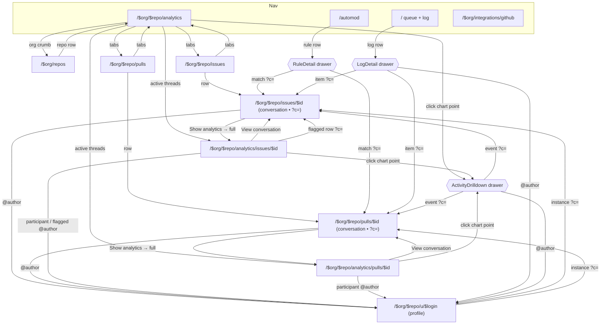

# modkit — routes, links & flows

A map of every route, what links to what, and the moderation flows that tie it
together — so anything problematic can be traced to its root and every surface
can be click-tested. Demo org/repo: **acme / tripwire**.

## Routes

| Route | What it is | Key search params |
|---|---|---|
| `/` | Moderation queue + **log** (home). Rows open a side-panel detail. | — |
| `/automod` | Automod rules. A rule row opens **RuleDetail** (recent matches). | — |
| `/analytics` | Global analytics (legacy: stat cards → big scrub chart + events). | `source`, `metric` |
| `/$org/repos` | Org repos list → each repo's analytics. | — |
| `/$org/integrations/github` | GitHub integration / active repo picker. | — |
| `/$org/$repo/analytics` | Repo analytics overview — metric cards → big chart, blocked-by-rule, active threads. | `metric` |
| `/$org/$repo/analytics/issues/$id` | Issue analytics drill-down (metrics, participants, flagged). | — |
| `/$org/$repo/analytics/pulls/$id` | PR analytics drill-down (metrics, participants, checks). | — |
| `/$org/$repo/issues` | Issues list (open/closed). | — |
| `/$org/$repo/issues/$id` | **Issue conversation** (the root). Highlights a comment. | `c` = commentId |
| `/$org/$repo/pulls` | Pulls list. | — |
| `/$org/$repo/pulls/$id` | **PR conversation** (the root). Highlights a comment. | `c` = commentId |
| `/$org/$repo/u/$login` | **Author profile** — every instance by a login, each → root. | — |

**Side-panel drawers** (open over a route, not their own URL): `ModerationDetail`
(queue), `RuleDetail` (automod), `LogDetail` (log), **`ActivityDrilldown`**
(chart-point spike → its comments, paginated, with automod attribution).

## Link graph



## Flows to test

1. **Automod → root.** `/automod` → click "Known spam domains" → in the drawer
   click a recent match → lands on the conversation with the comment glowing.
2. **Log → root.** `/` (log) → open a log entry → "view in thread" on an item →
   conversation, comment highlighted.
3. **Chart spike → its comments.** `/acme/tripwire/analytics` → click a point on
   the big chart → drawer lists ~value comments, "automod caught X of N",
   paginated → click a flagged row → root highlighted.
4. **Thread analytics ↔ conversation.** `/acme/tripwire/analytics/issues/97` →
   "View conversation" → back via the conversation's "Show analytics → View full
   analytics". Flagged rows + participant bars link to the author/comment.
5. **Author everywhere → profile → another instance.** Any `@author` →
   `/acme/tripwire/u/<login>` → lists every instance → click one → root.

## Test URLs (deep links)

```
/                                            queue + log
/automod                                     rules (open a rule for matches)
/acme/repos                                  repos list
/acme/tripwire/analytics                     overview (click a chart point)
/acme/tripwire/analytics/issues/97           issue analytics (flagged rows link)
/acme/tripwire/analytics/pulls/312           PR analytics
/acme/tripwire/issues                        issues list
/acme/tripwire/issues/97?c=97-1              conversation, comment 97-1 glowing
/acme/tripwire/pulls/312?c=312-2             PR conversation, 312-2 glowing
/acme/tripwire/u/new_user_44                 author profile (4 instances)
/acme/tripwire/u/airdrop_king                author profile
```

Highlightable root comments (the `?c=` ids): `97-1, 97-2, 97-4, 75-1, 75-2,
88-2, 91-9, 314-9, 83-9, 312-2`.
